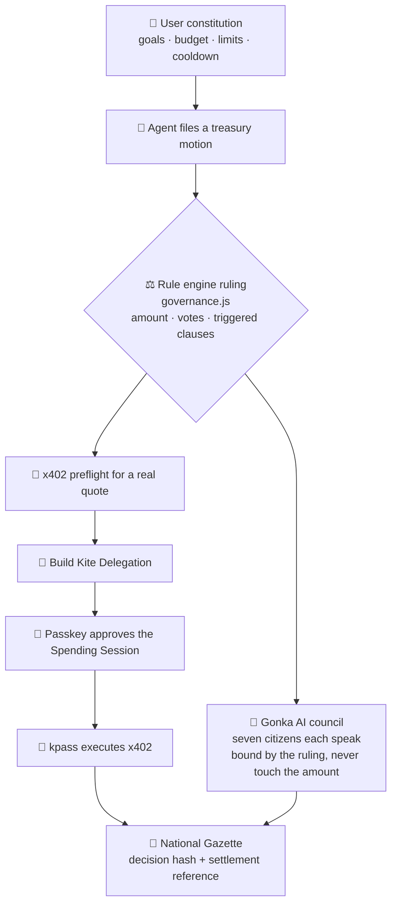

<div align="center">

# 🏰 Pocket Republic

**When AI starts spending on your behalf, it needs more than a wallet — it needs a constitution.**

[简体中文](./README.md) · `English`

[](https://docs.gokite.ai/)
[](https://gonkarouter.io/docs)
[](https://pocket-republic.vercel.app)

**🌥️ [Live sandbox: pocket-republic.vercel.app](https://pocket-republic.vercel.app)**

</div>

---

> **Pocket Republic is a tiny AI nation in your pocket.**
> You are the constitution-writer; AI Agents are its citizens. They can create, advise, and act — but every payment must first pass through your **personal constitution** and your **Kite treasury**.

---

## ✨ A nation that can spend on its own

Picture the childhood daydream of building your very own little country up in the clouds — with a treasury, a cabinet, and a constitution you wrote yourself. Except now the residents aren't toys. They're **AI Agents that act, and spend, on your behalf**.

Tomorrow's agents will buy their own APIs, data, compute, subscriptions, and courses. But a wallet that only asks *"confirm?"* **cannot carry that kind of trust.** You don't need another chatbot — you need a **governance layer that decides for you and stays bound by your rules.**

Pocket Republic wraps that serious idea inside a warm little fantasy nation:

- 🧑‍⚖️ **You are the founder** — you write the mission, the monthly budget, the per-transaction limit, the high-risk cap, the cooling-off periods.
- 🏛️ **Seven AI Agents are the citizens** — Prime Minister, Treasurer, Auditor, Opposition Leader, Caretaker, Builder, Archivist — each with a job, **loyal to the constitution, not to your momentary impulse.**
- 💸 **Every expense is a treasury motion** — it passes the constitution, then the parliament, and only then does the Kite treasury release funds within the session you approved.
- 📜 **Every payment is written into the National Gazette** — verifiable, traceable, exportable.

> Core demo: when you impulsively want to spend **300 USDT** chasing a meme coin, the Auditor and Treasurer invoke Article 3 and cut the cap to **10 USDT**, sending the other 290 into a **24-hour cooling-off period**. Kite lets the agent *pay*; Pocket Republic decides *whether it should*, and *how much*.

---

## 🎯 Why it fits Kite (Track 1 · Make It Agent-Payable)

Kite Agent Passport gives agents verifiable identity, a scoped wallet, and stablecoin payment power.
Pocket Republic solves **the layer above it**: *does this payment fit my goals, budget, and value boundaries?*

Every building in the fantasy maps **strictly** onto a real Kite mechanism:

| Pocket Republic | Kite mechanism |
| --- | --- |
| Founder | Passport Account Owner |
| Treasurer's Passport | Agent Passport / Agent DID |
| Treasury | Passport Wallet |
| Treasury Gate (spending authorization) | Scoped Spending Session |
| Constitutional fiscal clauses | Delegation Payment Policy |
| Diplomatic procurement | x402 HTTP Payment |
| National Gazette | Session History + x402 Receipt |
| On-chain receipt | Settlement Reference / Tx Hash |

> In one line: **it's a tiny AI nation in your pocket — and the first building open for business is the Kite treasury.**

---

## 🏛️ Architecture: rules decide, AI speaks, Kite settles



**Key design: money and words are separated.**

- **The rule engine (`governance.js`) is the *only* thing that decides amounts and votes** — deterministic, testable, impossible to talk out of.
- **Gonka AI only "speaks."** The seven citizens argue about *this specific* motion with grounded opinions, but are explicitly forbidden from **changing any amount or conclusion.** Real AI reasoning, safe deterministic payments.

### Two ways to run it

| Mode | How | What you get |
| --- | --- | --- |
| 🌥️ **Online sandbox** | Open Vercel | Full product logic + AI council (Vercel Serverless). Every credential is clearly marked **not on-chain**. |
| 🔗 **Local Kite mode** | `npm start` → `?provider=kite` | Real Kite Passport via official `kpass`/`ksearch`: real identity, Session, x402, Receipt. |

### Security boundaries

- 🔐 **The browser never touches a secret** — Kite JWT / OTP / Passkey / Gonka API key all live server-side only (local bridge or Vercel env vars).
- 🛡️ SSRF protection, HTTPS allow-list, argument-array `spawn` (no shell string-building), CLI timeouts and output caps, hardened response headers.
- 🧾 "Settled on-chain" is shown only when the official settlement reference returns; quotes and actual paid amounts are recorded separately — a quote is never passed off as a payment.

---

## 🤖 A parliament that actually thinks (real AI via Gonka)

The seven citizens are no longer canned lines. On every review, **sponsor Gonka (Anthropic Messages-compatible)** generates, in real time, a line for each citizen that fits their role and stays consistent with the constitutional ruling:

- **Rin / Auditor**: the Telegram pump talk trips clauses A1–A4; I oppose any FOMO, but I accept the constitution releasing only 10 USDT.
- **Luma / Caretaker**: the anxiety the group chat manufactured was just intercepted; a 24-hour cooldown lets the impulse burn off, and 10 USDT is enough to stay in the game.

A `Gonka AI` tag lights up next to each speech; while the call is in flight the parliament shows **"AI thinking…"**. With no key or when offline, it gracefully falls back to built-in scripted lines — **the demo never stalls.**

---

## 🗺️ Beyond payments: an expandable map

The Kite treasury is the first building open, but a single personal constitution can connect **an entire AI-agent nation.** Whichever department spends in the future, it must return to the same constitution and the same authorized limits.

| Department | One line | Status |
| --- | --- | --- |
| 🏛️ **Treasury Gate / Kite Treasury** | The constitutional gate for agent payments | ✅ Shipped (core) |
| 📜 **Archive / National Gazette** | A verifiable long-term governance record | ✅ Shipped |
| 🎨 **Studio** | Co-create with agents; purchases go through the treasury | 🧪 x402 procurement trial live |
| 🌱 **Sanctuary** | Hits the brakes when emotion takes over | 🔜 Roadmap v0.2 |
| 🎓 **Academy** | Unlock budget with learning milestones | 🔜 Roadmap v0.2 |
| ✉️ **Embassy** | Hire external agents & pay-per-call via Kite MCP | 🔜 Roadmap v0.2 |
| 🛍️ **Gadget Shop** | A market for pro agents / constitution templates / workflows | 🔜 Roadmap v0.2 |
| 🛂 **Passport Office** | Issue identity, permissions, and credit to each agent | 🔜 Roadmap v0.2 |

---

## 💰 Business roadmap

**The flywheel**: more agent citizens → more API/data/compute purchases → more payable services enter the Shop and Embassy → the nation gets more useful → every action distills into sharper policy and reputation.

1. **Free** — one nation, a basic constitution, sandbox governance.
2. **Pro** — advanced policy guardrails, long-term gazette archive, more agent citizens, cross-device sync, real wallet provider.
3. **Team** — families / studios / startups share a treasury, role permissions, multi-tier approvals, and audit export.
4. **Agent & service marketplace** — citizens buy APIs, data, compute, workflows; the platform takes a transaction fee.
5. **Constitution-as-Policy SDK** — the long game: *any AI-agent product that wants to spend on a user's behalf can plug into Pocket Republic's constitutional approval layer.*

> Once agents can pay, the truly scarce thing is: **who decides which payments should happen.**

---

## 🚀 Quickstart

### 1. Online sandbox (zero install)

Just open **[pocket-republic.vercel.app](https://pocket-republic.vercel.app)**. Full product logic runs, but it never claims an on-chain transaction happened.

> To enable the **online AI council**, set `GONKA_API_KEY` in Vercel → Settings → Environment Variables (the key stays server-side, never in the browser). Without it, the council falls back to scripted lines.

### 2. Run locally (with the real AI council)

```bash
git clone https://github.com/LierMi/pocket-republic.git
cd pocket-republic
cp .env.example .env      # add your GONKA_API_KEY
npm start                 # open http://127.0.0.1:5180
```

### 3. Kite Passport real-payment mode

Requires the official CLI, login, a Passkey, and a funded balance — credentials stay on your machine:

```bash
curl -fsSL https://agentpassport.ai/install.sh | bash
kpass login init && kpass login verify
npm start
# open http://127.0.0.1:5180/?provider=kite
```

Full steps in [`docs/KITE_INTEGRATION.md`](./docs/KITE_INTEGRATION.md).

---

## 🧱 Stack · Tests · Structure

- **Frontend**: vanilla HTML / CSS / ES Modules, zero framework; original WebGL cloud sea, chaptered transitions, reduced-motion fallbacks.
- **Bridge**: a Node `http` local server `server.mjs` that safely proxies the Kite CLI and Gonka.
- **AI council**: `gonka.js` shared logic, used by both the local bridge and the Vercel Serverless function (`api/council.js`).

```bash
npm test   # product structure / governance logic / FOMO risk / Kite envelope / bridge contracts
```

```text
pocket-republic/
├── index.html · styles.css · app.js      # single-page product
├── governance.js                          # rule engine (sole authority on amount & votes)
├── nation-policies.js                     # four republic templates & constitutions
├── gonka.js                               # Gonka AI council (shared)
├── api/council.js                         # Vercel Serverless council endpoint
├── server.mjs                             # local Kite + Gonka security bridge
├── adapters/kite-provider.js              # Sandbox + Kite Passport provider
└── docs/                                  # world bible / Kite integration / demo script
```

---

## 🙏 Credits

- **[Kite AI](https://gokite.ai/)** — Agent Passport, Scoped Spending Session, and x402 give agents a verifiable economic identity.
- **[Gonka](https://gonkarouter.io/)** — real AI reasoning for the citizens' parliament.

<div align="center">

**Pocket Republic** — every payment must pass through your constitution first.

</div>
