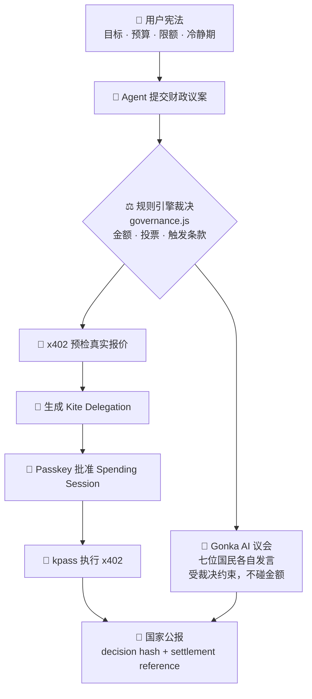

<div align="center">

# 🏰 Pocket Republic · 口袋共和国

**当 AI 开始替你花钱，它需要的不只是一只钱包，而是一部宪法。**

`简体中文` · [English](./README.en.md)

[](https://docs.gokite.ai/)
[](https://gonkarouter.io/docs)
[](https://pocket-republic.vercel.app)

**🌐 [在线体验 pocket-republic.vercel.app](https://pocket-republic.vercel.app)**<br>
**🎬 [Demo 演示视频](https://drive.google.com/file/d/19AXeu_3nqX_VKWEkK3kvlVZXHv-bjso5/view?usp=sharing)**

</div>

---

> **Pocket Republic 是一个由 AI Agent 国民共同治理的个人国度。**
> 你是立宪者，写下目标、预算与边界；七位不同职责的 Agent 组成内阁，依据宪法协作、审议并执行行动。
> 我们从 Kite 国库切入，让 Agent 在可验证身份和授权额度内安全花钱；未来，同一套治理制度将扩展到创作、学习、情绪、关系与长期人生目标。

---

## ✨ 一个能自己花钱的国家

想象你拥有一座真正可以运行的微型国家：有国库、有内阁，也有一部由你亲手写下的宪法。住在这里的不是被动等待命令的工具，而是**会替你行动、会替你花钱，同时必须接受制度约束的 AI Agent**。

未来的 Agent 会自己去买 API、数据、算力、订阅、课程。可是一只只会问"确认吗？"的钱包，**不足以承载这种信任**。你需要的不是又一个聊天机器人，而是一个**代表你做决定、并且永远受你约束的治理层**。

Pocket Republic 把这件严肃的事，装进了一个有温度的幻想国度里：

- 🧑‍⚖️ **你是立宪者** —— 写下国家使命、月度预算、单笔限额、高风险上限、冷静期。
- 🏛️ **七位 AI Agent 是国民** —— 首相、财政大臣、审计官、反对党领袖、心灵部长、建设部长、书记官，各司其职，**忠于宪法，而不是迎合你一时的冲动**。
- 💸 **每一笔支出都是一场财政议案** —— 先过宪法、再过议会、最后才由 Kite 国库在你授权的额度内放行。
- 📜 **每一次花钱都写进国家公报** —— 可核验、可追溯、可导出。

> 核心演示：当你冲动地想花 **300 USDT** 追一个 meme 币，审计官与财政大臣依据宪法第三条，把上限压到 **10 USDT**，其余 290 进入 **24 小时冷静期**。Kite 让 Agent *能*支付，Pocket Republic 决定它*该不该*支付、*能付多少*。

---

## 🎯 为什么贴合 Kite（赛道一 · Make It Agent-Payable）

Kite Agent Passport 让 Agent 拥有可验证身份、受控钱包与稳定币支付能力。
Pocket Republic 解决的是**上面那一层**：*这笔支付，是否符合我的目标、预算和价值边界？*

幻想叙事里的每一个建筑，都**严格对应** Kite 的真实机制：

| 口袋共和国 | Kite 官方机制 |
| --- | --- |
| 立宪者 | Passport Account Owner |
| 财政大臣护照 | Agent Passport / Agent DID |
| 国库 | Passport Wallet |
| 国库大门（额度授权） | Scoped Spending Session |
| 宪法财政条款 | Delegation Payment Policy |
| 外交采购 | x402 HTTP Payment |
| 国家公报 | Session History + x402 Receipt |
| 链上回执 | Settlement Reference / Tx Hash |

> **Kite 测试网接入状态：**我们已在 Kite dev 测试网完成账户登录、Agent Passport 注册、测试资产领取、Scoped Spending Session 创建与 Passkey 授权。当前尚未完成最终 x402 支付结算，因此不展示或伪造 Settlement Reference、交易哈希与链上 Receipt。

> 一句话：**这是一个口袋里的 AI 小国，第一座开门营业的建筑，就是 Kite 国库。**

---

## 🏛️ 架构：规则拍板，AI 发声，Kite 结算



**关键设计：钱和话分离。**

- **规则引擎（`governance.js`）是唯一拍板金额和投票的地方** —— 确定、可测试、不可被话术带偏。
- **Gonka AI 只负责"发言"** —— 七位国民针对*这一笔*议案说出有理有据的观点，但被明确约束**不得改动任何金额或结论**。真实的 AI 推理，安全的确定性支付。

### 安全边界

- 🔐 **浏览器永远不接触任何密钥** —— Kite JWT / OTP / Passkey / Gonka API Key 全部只在服务端（本地桥接或 Vercel 环境变量）。
- 🛡️ SSRF 防护、HTTPS 白名单、参数数组 `spawn`（不拼接 shell）、CLI 超时与输出上限、安全响应头。
- 🧾 只有官方返回 settlement reference 时才显示"链上已结算"；报价与实付分开记录，绝不把报价冒充实付。

---

## 🤖 会思考的议会（Gonka 真实 AI）

Pocket Republic 不是让七个 Agent 重复给建议，而是让它们进入一套有职责、权限、制衡与记录的国家制度。每位国民都忠于同一部个人宪法，但从不同位置审视议案：

| Agent 国民 | 国家职位 | 所属部门 | 在议会中的责任 |
| --- | --- | --- | --- |
| **丘吉尔** | 首相 | 内阁 | 统合各部门意见，把议会结论整理成可执行的国家决定 |
| **巴菲特** | 财政大臣 | Kite 国库 | 核对余额、预算、授权额度与支付条件，只放行合宪支出 |
| **包拯** | 审计官 | 审计院 | 检查风险、利益冲突与历史记录，追问每一笔钱的责任 |
| **达·芬奇** | 建设部长 | 创作工坊 | 判断支出是否服务于真实目标，并提出更高效的替代方案 |
| **苏格拉底** | 反对党领袖 | 国民议会 | 强制提出反方论证，防止单一 Agent 与立宪者情绪形成共谋 |
| **尼采** | 心灵部长 | 心灵花园 | 识别焦虑、FOMO 与冲动状态，必要时建议冷静期或暂停决策 |
| **博尔赫斯** | 书记官 | 档案馆 | 记录议案、投票、支付与哈希，把国家行为写成可追溯公报 |

七位国民的发言不再是写死台词。每次审议，**赞助方 Gonka（Anthropic Messages 兼容，模型 `moonshotai/Kimi-K2.6`）** 会为每位国民实时生成符合其身份、且与宪法裁决一致的观点。例如：

- **包拯 / 审计官**：Telegram 拉盘话术触发 A1 至 A4 全条款，我反对任何沉迷，但接受宪法只放行 10 USDT 的裁决。
- **尼采 / 心灵部长**：群聊制造的焦虑刚被拦截，24 小时冷静期正好让冲动退烧，10 USDT 足够维持参与感。

发言旁会亮起 `Gonka AI` 标签；调用期间议会显示 **"AI 思考中…"**。没有配置 key 或离线时，自动优雅退回内置脚本发言 —— **演示永不卡壳**。

---

## 👥 AI 国民系统：自定义 + 真实信用分

### 自定义国民

七位名人内阁（丘吉尔 / 巴菲特 / 包拯 / 达·芬奇 / 苏格拉底 / 尼采 / 博尔赫斯）都可以在线编辑；你也可以**创造自己的国民**加入 AI 议会辩论。

技术实现：
- **`citizenStore`** 持久化在 `localStorage`，结构 `{ overrides: {id→patch}, custom: [...] }`。
- **`getCitizens()`** 将内置 7 人、用户覆盖、自定义国民三路合并为统一列表，对外只暴露这一个接口。
- **头像**：上传图片 → Canvas 压缩至 256px JPEG 0.82 → data URL；或直接输入 Emoji。
- **进入 AI 议会**：`buildCouncilDebate()` 把自定义国民的 `persona` 字段传给 Gonka，AI 用你写的性格口吻发言；`scriptedSpeech()` 按 `citizen.id` switch 处理内置 7 人，自定义国民按其 `stance` 偏好生成兜底发言。

### 实时信用分（真实计算）

每张国民卡右上角的分数**不是写死的**，而是实时从公报历史计算出来的立场对齐率：

```
gazette 每条记录现包含完整 debate 数组
winningStance(action) 将最终裁决映射到「预期立场」
  approve → "approve"  |  deny → "oppose"
  reduce  → "reduce"   |  delay → "delay"
  override_execute → 跳过（立宪者强推不算议会成绩）

信用分 = base × (1-w) + (aligned/participated) × 100 × w
w 随公报笔数增长（约 4 笔后饱和到 0.6）
```

有真实公报数据时，分数变为**青绿色**并显示「N笔」，鼠标悬停显示「基于 N 笔公报」。每次审批完成、公报写入后立即刷新。

---

## 📄 国家护照导出

点击状态条的「**护照导出**」按钮，弹出两页式可视化护照：

| 封面页（左） | 数据页（右） |
|---|---|
| 深海军蓝底色，金色 SVG 国玺 | 米白底色，深色结构化文字 |
| 国家名 / 治理模板 / 签发日期 | 持有者信息（名称/预算/国民数/Agent 护照/宪法哈希） |
| 装饰性 MRZ 机读区 | 宪法前 5 条 + 近期公报（批准/拒绝/缩减色块区分） |

**「↓ 下载 JSON」** 导出的护照文件包含：
```json
{
  "version": "pocket-republic-passport-v1",
  "republic": { "name", "template", "mission", "monthlyBudget" },
  "constitution": [ { "id", "chapter", "title", "text" } ],
  "citizens": [ { "name", "role", "persona", "reputationScore", "custom" } ],
  "gazette": [ { "title", "action", "approvedAmount", "decisionHash", "createdAt" } ],
  "kite": { "agentPassportId", "sessionId", "providerMode" }
}
```

**「打印 / PDF」** 触发 `window.print()`，配套 `@media print` 样式表隐藏其余页面内容，直接存为 PDF 即得到可分享的护照文档。

---

## 🗺️ 不止支付：可扩张的国家版图

Kite 国库是这个国家第一套真正运行的公共制度，而不是产品的终点。Pocket Republic 的长期形态，是一套由个人宪法驱动的 AI 操作系统：同一群 Agent 国民在不同部门协作，照看你的金钱、项目、学习、情绪与长期目标。

### 中央制度：让 Agent 从角色变成国民

| 国家制度 | 产品能力 | 当前状态 |
| --- | --- | --- |
| **个人宪法** | 定义国家使命、预算、权限、禁区、冷静期与强制审查线 | ✅ 已实现，可逐条编辑 |
| **内阁与国民议会** | 七位 Agent 分工讨论，规则引擎负责最终裁决 | ✅ 已实现，Gonka 生成实时发言 |
| **Kite 国库** | Agent Passport、授权额度、Scoped Session 与支付预检 | ✅ Kite 测试网身份及授权已接入 |
| **审计院** | 扫描风险、核对历史行为、阻止越权与冲动支出 | ✅ 已实现核心审查链路 |
| **档案馆与国家公报** | 保存议案、投票、凭证、决策哈希与国民信用 | ✅ 已实现 |

### 国家部门：让同一部宪法进入生活的不同领域

| 国家部门 | 它为立宪者做什么 | 与国库的关系 | 路线状态 |
| --- | --- | --- | --- |
| **创作工坊** | 与你共创项目、拆解目标、评估方案与生产资源 | API、数据、算力和 SaaS 采购先提交财政议案 | 🧪 已有 x402 采购原型 |
| **心灵花园** | 在焦虑、FOMO 与重大情绪中提供陪伴、自我反思和冷静期 | 强情绪状态可临时冻结非必要支出，不替代专业医疗 | 🔜 Roadmap v0.2 |
| **Agent 大学** | 制定学习计划、验证里程碑、组织知识与长期成长档案 | 完成任务后解锁课程尾款或学习悬赏 | 🔜 Roadmap v0.2 |
| **外交部** | 代表个人国度连接外部服务、商家、DAO 与其他 Agent 国家 | 所有外部采购和合作都受身份、范围与额度约束 | 🔜 Roadmap v0.3 |
| **佣兵公会** | 雇佣专业 Agent、MCP 与按次付费 API 完成任务 | 按任务托管预算，交付验收后结算 | 🔜 Roadmap v0.3 |
| **道具铺** | 提供专业国民、宪法模板、工作流和可信服务 | 形成 Agent 与服务交易市场 | 🔜 Roadmap v0.3 |
| **护照局** | 为每位 Agent 管理身份、权限、信誉与行为历史 | 决定谁能申请、审批或执行一笔支出 | 🧪 已有国民卡与信用分原型 |

无论国家扩张到哪个领域，权力都沿着同一条路径运行：**身份可验证、权限有边界、行动先审议、结果进公报**。这样，未来增加的不是一堆彼此割裂的 AI 功能，而是一座会随个人目标持续生长、同时始终受其主人约束的 Agent 国家。

---

## 💰 商业路线

Pocket Republic 不靠售卖世界观成立。它解决的是一个会随着 Agent 经济增长而持续放大的现实问题：**谁定义 Agent 的权力，谁批准它的行动，出了问题又由谁留下可审计的责任记录。**

### 产品演进

| 阶段 | 产品形态 | 核心价值 |
| --- | --- | --- |
| **v0.1 · 国库治理** | 个人宪法 + 多 Agent 审议 + Kite 支付边界 | 先解决 Agent 能不能花、谁能花、最多花多少 |
| **v0.2 · 个人 AI 国度** | 创作、学习、心灵与档案部门逐步开放 | 同一部宪法开始治理金钱以外的长期目标 |
| **v0.3 · 国民与服务市场** | 专业 Agent、MCP、API、数据和工作流进入道具铺与佣兵公会 | Agent 可以被雇佣、协作、交付并按结果结算 |
| **v0.4 · 团队共和国** | 家庭、工作室与创业团队共享宪法和国库 | 提供角色权限、多级审批、共同预算与审计导出 |
| **v1.0 · Agent 治理基础设施** | Constitution-as-Policy SDK / API | 任何替用户行动或花钱的 Agent 都能接入同一套治理层 |

### 收入模型

1. **Free** —— 一个个人国度、基础宪法、有限国民与沙盒治理。
2. **Pro 订阅** —— 高级政策护栏、长期记忆与公报、更多国民、跨设备同步和真实钱包 Provider。
3. **Team 订阅** —— 家庭、工作室、创业团队的共享国库、角色权限、多级审批和合规审计。
4. **Agent 与服务市场** —— 专业国民、宪法模板、MCP、API、数据、算力和工作流的上架费与交易服务费。
5. **支付与任务抽成** —— 在佣兵公会的外部雇佣、按次调用和里程碑结算中收取协议服务费。
6. **Constitution-as-Policy SDK** —— 面向钱包、AI 助手、Agent 平台与企业提供治理 API、策略引擎和审计能力。

### 商业复利

**更多 Agent 国民 → 更多真实行动与服务采购 → 更多可信服务进入市场 → 更多议案沉淀为政策、信誉与个人治理档案 → 国度更懂用户的长期边界 → 留存与交易规模继续增长。**

普通 AI 产品积累聊天记录，Pocket Republic 积累的是结构化的个人治理资产：目标如何排序、预算如何分配、什么情况下需要暂停、哪些 Agent 值得信任。这些数据可以不断提升宪法模板、风险模型和服务匹配质量，但控制权始终属于立宪者。

> Agent 获得支付能力之后，真正稀缺的不是更多会花钱的 AI，而是一套始终记得**谁授权、为何行动、花了多少、留下什么责任**的制度。

---

## 🚀 快速开始

### 1. 在线建国（零安装）

直接打开 **[pocket-republic.vercel.app](https://pocket-republic.vercel.app)**。完整产品逻辑都会跑，但不会宣称发生了链上交易。

> 想让**在线 AI 议会**也生效，在 Vercel → Settings → Environment Variables 配置 `GONKA_API_KEY` 即可（密钥存服务端，绝不进浏览器）。未配置时议会自动退回脚本发言。

### 2. 本地运行（含真实 AI 议会）

```bash
git clone https://github.com/LierMi/pocket-republic.git
cd pocket-republic
cp .env.example .env      # 填入 GONKA_API_KEY
npm start                 # 打开 http://127.0.0.1:5180
```

### 3. Kite Passport 真实模式（含免费测试网）

官方 CLI 已内置在 `.kite-tools/bin/`，凭证只留本机（`.gitignore` / `.vercelignore` 已排除）。

**A · 测试网** —— 用 Kite `dev` 环境 + faucet 免费领测试稳定币：

```bash
DEV=https://passport.dev.gokite.ai
K=./.kite-tools/bin/kpass

# 1) 注册/登录（邮件收 8 位码）
$K signup init  --email <邮箱> --base-url $DEV --client agent --output json
$K signup exchange --signup-id <上一步 id> --code <邮件里的码> --base-url $DEV --output json

# 2) 注册 Agent（财政大臣）
$K agent:register --type pocket-republic-treasurer --base-url $DEV --output json

# 3) 领免费测试稳定币（测试网用 PIEUSD，不是 USDC）
$K wallet address --base-url $DEV --output json           # 取 Base 地址
$K faucet drop --recipient <地址> --token PIEUSD --base-url $DEV --output json

# 4) 创建 Spending Session → 打开返回的 approval_url，用 Passkey 批准（首次会引导建 Passkey）
$K agent:session create --base-url $DEV --output json \
  --delegation '{"task":{"summary":"x402 test"},"payment_policy":{"assets":["0x38129cf4CE5E183eFF248F42A7D345Bb1B47621A"],"max_amount_per_tx":"1","max_total_amount":"2","ttl_seconds":3600},"execution_constraints":{"x402_http":{"scope_mode":"scoped","allowed_endpoints":[{"method":"GET","host":"passport.dev.gokite.ai","path_prefix":"/x402/test"}]}}}'
```

让 app 连到 dev（写进本地 `.env`，勿提交），再启动：

```bash
# .env
KITE_PASSPORT_BASE_URL=https://passport.dev.gokite.ai
KITE_ALLOWED_HOSTS=stablecrypto.dev,x402.dev.gokite.ai,passport.dev.gokite.ai
```
```bash
npm start    # 打开 http://127.0.0.1:5180/?provider=kite
```

`?provider=kite` 下，国库大门四道门会显示**真实身份 + 真实已批准 Session**。

> ⚠️ **诚实说明**：Kite 测试网的付款*执行*受"可执行服务目录"白名单限制——自助账户能预检、能创建并 Passkey 批准 Session，但对测试端点的最终结算需 Kite 为你的账户开白名单。未放行时页面诚实标注 **「测试网结算待放行 · Roadmap v0.2」**，绝不伪造 tx。

**B · 主网（真实结算，约几分钱）** —— 同上但去掉 `--base-url`（默认 prod）、给钱包充值几毛 **USDC（Base）**，议案走可执行目录里的服务（如 StableCrypto），即可拿到真实 Receipt + settlement reference。

更多细节见 [`docs/KITE_INTEGRATION.md`](./docs/KITE_INTEGRATION.md)。

---

## 🧱 技术栈 · 测试 · 结构

- **前端**：原生 HTML / CSS / ES Modules，零框架；原创 WebGL 开屏背景、章节切换、reduced-motion 回退。
- **桥接**：Node `http` 本地服务 `server.mjs`，安全代理 Kite CLI 与 Gonka。
- **AI 议会**：`gonka.js` 共享逻辑，本地桥接与 Vercel Serverless（`api/council.js`）共用。
- **国民数据层**：`citizenStore`（localStorage）+ `getCitizens()` 三路合并 + Canvas 头像压缩。
- **信用分引擎**：公报存 `debate` 数组 → `winningStance()` → 对齐率加权混合。
- **护照导出**：`openPassportExport()`（async，含 `constitutionHash()`）+ `downloadPassportJson()` + `@media print`。

```bash
npm test   # 产品结构 / 宪法逻辑 / FOMO 风控 / Kite envelope / 桥接 合约断言
```

```text
pocket-republic/
├── index.html · styles.css · app.js      # 单页产品
│   ├── citizenStore / getCitizens()       # 国民数据层（内置 + 覆盖 + 自定义）
│   ├── computeReputationScore()           # 实时信用分（公报对齐率）
│   └── openPassportExport()              # 护照导出（视觉 + JSON + 打印）
├── governance.js                          # 规则引擎（金额与投票的唯一裁决者）
├── nation-policies.js                     # 四套共和国模板与宪法
├── gonka.js                               # Gonka AI 议会（共享）
├── api/council.js                         # Vercel Serverless 议会接口
├── server.mjs                             # 本地 Kite + Gonka 安全桥接
├── adapters/kite-provider.js              # Sandbox + Kite Passport Provider
└── docs/                                  # 世界观 / Kite 集成 / Demo 脚本
```

---

## 🙏 致谢

- **[Kite AI](https://gokite.ai/)** —— Agent Passport、Scoped Spending Session、x402，让 Agent 拥有可验证的经济身份。
- **[Gonka](https://gonkarouter.io/)** —— 为国民议会提供真实 AI 推理。

<div align="center">

**Pocket Republic** —— 先用宪法守住一笔钱，再让同一部宪法照看一个人的长期目标。

</div>
