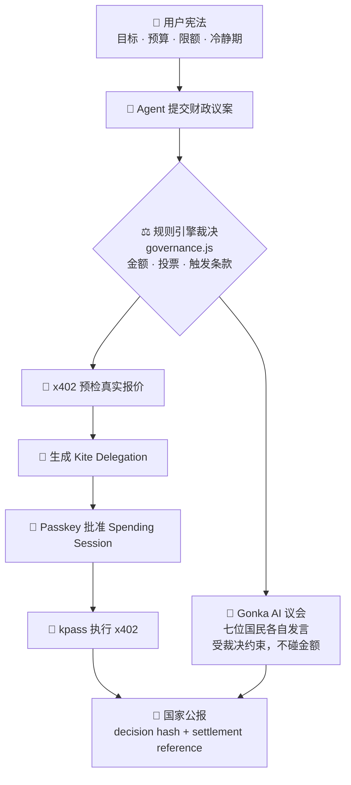

<div align="center">

# 🏰 Pocket Republic · 口袋共和国

**当 AI 开始替你花钱，它需要的不只是一只钱包，而是一部宪法。**

`简体中文` · [English](./README.en.md)

[](https://docs.gokite.ai/)
[](https://gonkarouter.io/docs)
[](https://pocket-republic.vercel.app)

**🌥️ [在线沙盒 pocket-republic.vercel.app](https://pocket-republic.vercel.app)**

</div>

---

> **Pocket Republic 是你口袋里的一座 AI 小国。**
> 你是立宪者，AI Agent 是国民；它们能创作、能建议、能行动——但每一次花钱，都必须先经过你的**个人宪法**和 **Kite 国库**。

---

## ✨ 一个能自己花钱的国家

想象童年时，你在云端亲手搭起一座只属于自己的小国：有国库、有内阁、有一部你亲手写下的宪法。现在，住在里面的不再是玩具，而是**会替你行动、会替你花钱的 AI Agent**。

未来的 Agent 会自己去买 API、数据、算力、订阅、课程。可是一只只会问"确认吗？"的钱包，**不足以承载这种信任**。你需要的不是又一个聊天机器人，而是一个**代表你做决定、并且永远受你约束的治理层**。

Pocket Republic 把这件严肃的事，装进了一个有温度的幻想国度里：

- 🧑‍⚖️ **你是立宪者** —— 写下国家使命、月度预算、单笔限额、高风险上限、冷静期。
- 🏛️ **七位 AI Agent 是国民** —— 首相、财政大臣、审计官、反对党领袖、心灵部长、建设部长、书记官，各司其职，**忠于宪法，而不是迎合你一时的冲动**。
- 💸 **每一笔支出都是一场财政议案** —— 先过宪法、再过议会、最后才由 Kite 国库在你授权的额度内放行。
- 📜 **每一次花钱都写进国家公报** —— 可核验、可追溯、可导出。

> 核心演示：当你冲动地想花 **300 USDT** 追一个 meme 币，审计官与财政大臣依据宪法第三条，把上限压到 **10 USDT**，其余 290 进入 **24 小时冷静期**。Kite 让 Agent *能*支付，Pocket Republic 决定它*该不该*支付、*能付多少*。

---

## 🎯 为什么贴合 Kite（赛道一 · Make It Agent-Payable）

Kite Agent Passport 让 Agent 拥有可验证身份、受控钱包与稳定币支付能力。
Pocket Republic 解决的是**上面那一层**：*这笔支付，是否符合我的目标、预算和价值边界？*

幻想叙事里的每一个建筑，都**严格对应** Kite 的真实机制：

| 口袋共和国 | Kite 官方机制 |
| --- | --- |
| 立宪者 | Passport Account Owner |
| 财政大臣护照 | Agent Passport / Agent DID |
| 国库 | Passport Wallet |
| 国库大门（额度授权） | Scoped Spending Session |
| 宪法财政条款 | Delegation Payment Policy |
| 外交采购 | x402 HTTP Payment |
| 国家公报 | Session History + x402 Receipt |
| 链上回执 | Settlement Reference / Tx Hash |

> 一句话：**这是一个口袋里的 AI 小国，但第一座开门营业的建筑，就是 Kite 国库。**

---

## 🏛️ 架构：规则拍板，AI 发声，Kite 结算



**关键设计：钱和话分离。**

- **规则引擎（`governance.js`）是唯一拍板金额和投票的地方** —— 确定、可测试、不可被话术带偏。
- **Gonka AI 只负责"发言"** —— 七位国民针对*这一笔*议案说出有理有据的观点，但被明确约束**不得改动任何金额或结论**。真实的 AI 推理，安全的确定性支付。

### 两种运行模式

| 模式 | 怎么跑 | 有什么 |
| --- | --- | --- |
| 🌥️ **在线沙盒** | 直接开 Vercel | 完整产品逻辑 + AI 议会（Vercel Serverless）。所有凭证明确标注**非链上**。 |
| 🔗 **本地 Kite 真实模式** | `npm start` → `?provider=kite` | 通过官方 `kpass`/`ksearch` 真连 Kite Passport：真实身份、Session、x402、Receipt。 |

### 安全边界

- 🔐 **浏览器永远不接触任何密钥** —— Kite JWT / OTP / Passkey / Gonka API Key 全部只在服务端（本地桥接或 Vercel 环境变量）。
- 🛡️ SSRF 防护、HTTPS 白名单、参数数组 `spawn`（不拼接 shell）、CLI 超时与输出上限、安全响应头。
- 🧾 只有官方返回 settlement reference 时才显示"链上已结算"；报价与实付分开记录，绝不把报价冒充实付。

---

## 🤖 会思考的议会（Gonka 真实 AI）

七位国民不再是写死的台词。每次审议，**赞助方 Gonka（Anthropic Messages 兼容）** 会为每位国民实时生成一句符合其身份、且与宪法裁决一致的发言：

- **Rin / 审计官**：Telegram 拉盘话术触发 A1 至 A4 全条款，我反对任何沉迷，但接受宪法只放行 10 USDT 的裁决。
- **Luma / 心灵部长**：群聊制造的焦虑刚被拦截，24 小时冷静期正好让冲动退烧，10 USDT 足够维持参与感。

发言旁会亮起 `Gonka AI` 标签；调用期间议会显示 **"AI 思考中…"**。没有配置 key 或离线时，自动优雅退回内置脚本发言 —— **演示永不卡壳**。

---

## 🗺️ 不止支付：可扩张的国家版图

Kite 国库是第一座开门的建筑，但一部个人宪法可以连接**一整个 AI Agent 国度**。无论未来哪个部门发起花费，都必须回到同一套宪法与授权额度。

| 部门 | 一句话 | 状态 |
| --- | --- | --- |
| 🏛️ **国库大门 / Kite 国库** | Agent 支付的宪法闸口 | ✅ 已实现（核心） |
| 📜 **档案馆 / 国家公报** | 可核验的长期治理档案 | ✅ 已实现 |
| 🎨 **创作工坊** | Agent 与你共创，采购走国库 | 🧪 已接入 x402 采购试验 |
| 🌱 **心灵花园** | 情绪上头时替你踩刹车 | 🔜 Roadmap v0.2 |
| 🎓 **Agent 大学** | 考官 Agent 验证里程碑，达标才解锁下一笔预算 | 🔜 Roadmap v0.2 |
| ⚔️ **佣兵公会** | 雇外部 Agent 与按次付费 API 替你干活，每次都先过宪法 | 🔜 Roadmap v0.2 |
| 🛍️ **道具铺** | 专业 Agent / 宪法模板 / 工作流市场 | 🔜 Roadmap v0.2 |
| 🛂 **护照局** | 给每个 Agent 发身份、权限与信用分 | 🔜 Roadmap v0.2 |

---

## 💰 商业路线

**产品飞轮**：更多 Agent 国民 → 更多 API/数据/算力采购 → 更多可支付服务进入道具铺与佣兵公会 → 个人国度更有用 → 每次行为沉淀为更准确的政策与信誉。

1. **免费层** —— 一个国家、基础宪法、沙盒治理。
2. **个人订阅 Pro** —— 高级 policy guardrails、长期公报档案、多 Agent 国民、跨设备同步、真实钱包 provider。
3. **团队版 Team** —— 家庭 / 工作室 / 创业团队共享国库、角色权限、多级审批与审计导出。
4. **Agent & 服务市场** —— 国民购买 API、数据、算力、工作流，平台收取交易服务费。
5. **Constitution-as-Policy SDK** —— 长期方向：*任何想替用户花钱的 AI Agent 产品，都可以接入 Pocket Republic 的宪法审批层。*

> Agent 有支付能力之后，真正稀缺的是：**谁来帮用户决定，哪些支付应该发生。**

---

## 🚀 快速开始

### 1. 在线沙盒（零安装）

直接打开 **[pocket-republic.vercel.app](https://pocket-republic.vercel.app)**。完整产品逻辑都会跑，但不会宣称发生了链上交易。

> 想让**在线 AI 议会**也生效，在 Vercel → Settings → Environment Variables 配置 `GONKA_API_KEY` 即可（密钥存服务端，绝不进浏览器）。未配置时议会自动退回脚本发言。

### 2. 本地运行（含真实 AI 议会）

```bash
git clone https://github.com/LierMi/pocket-republic.git
cd pocket-republic
cp .env.example .env      # 填入 GONKA_API_KEY
npm start                 # 打开 http://127.0.0.1:5180
```

### 3. Kite Passport 真实支付模式

需要官方 CLI、登录、Passkey 与可用余额，凭证只留本机：

```bash
curl -fsSL https://agentpassport.ai/install.sh | bash
kpass login init && kpass login verify
npm start
# 打开 http://127.0.0.1:5180/?provider=kite
```

完整步骤见 [`docs/KITE_INTEGRATION.md`](./docs/KITE_INTEGRATION.md)。

---

## 🧱 技术栈 · 测试 · 结构

- **前端**：原生 HTML / CSS / ES Modules，零框架；原创 WebGL 云海、章节切换、reduced-motion 回退。
- **桥接**：Node `http` 本地服务 `server.mjs`，安全代理 Kite CLI 与 Gonka。
- **AI 议会**：`gonka.js` 共享逻辑，本地桥接与 Vercel Serverless（`api/council.js`）共用。

```bash
npm test   # 产品结构 / 宪法逻辑 / FOMO 风控 / Kite envelope / 桥接 合约断言
```

```text
pocket-republic/
├── index.html · styles.css · app.js      # 单页产品
├── governance.js                          # 规则引擎（金额与投票的唯一裁决者）
├── nation-policies.js                     # 四套共和国模板与宪法
├── gonka.js                               # Gonka AI 议会（共享）
├── api/council.js                         # Vercel Serverless 议会接口
├── server.mjs                             # 本地 Kite + Gonka 安全桥接
├── adapters/kite-provider.js              # Sandbox + Kite Passport Provider
└── docs/                                  # 世界观 / Kite 集成 / Demo 脚本
```

---

## 🙏 致谢

- **[Kite AI](https://gokite.ai/)** —— Agent Passport、Scoped Spending Session、x402，让 Agent 拥有可验证的经济身份。
- **[Gonka](https://gonkarouter.io/)** —— 为国民议会提供真实 AI 推理。

<div align="center">

**Pocket Republic** —— 每一次花钱，都必须先经过你的宪法。

</div>
